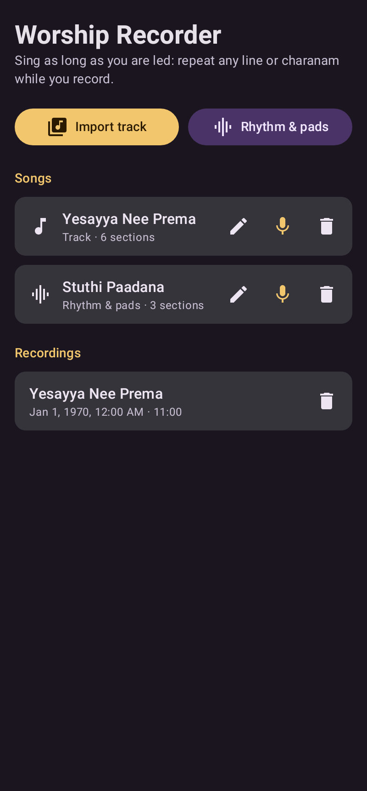
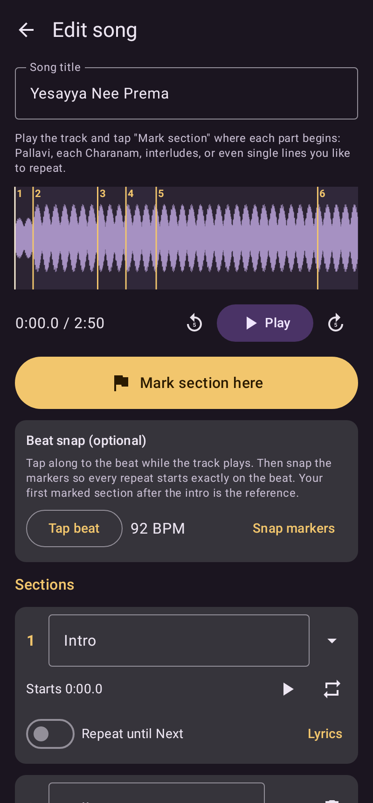
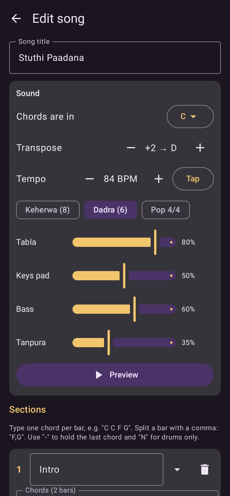
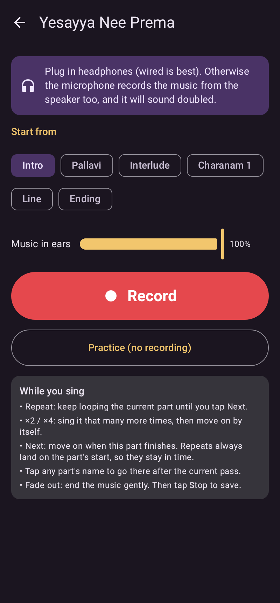
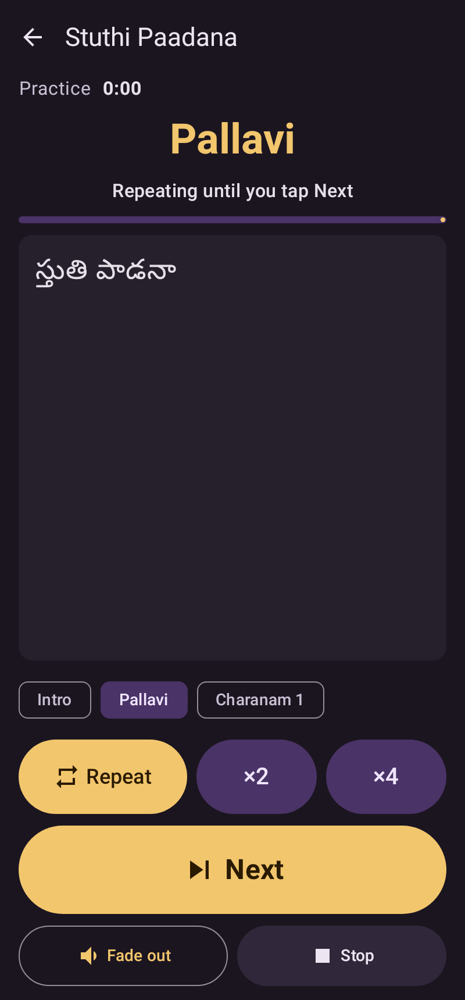
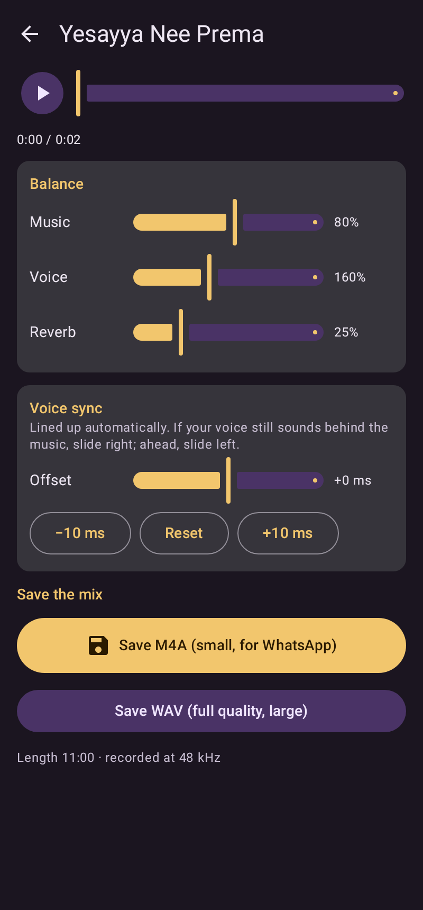

# Worship Recorder

An Android app for recording worship songs (made with Telugu Christian songs in mind) over
background music, **stretching the song as long as you are led**. Repeat a line, the Pallavi or a
Charanam as many times as you like while you sing, so a 5-minute song can become a 10–15 minute
time of worship, and the music always stays in time.

| Home | Mark sections | Rhythm & pads | Ready to sing | Singing | Mix & share |
|---|---|---|---|---|---|
|  |  |  |  |  |  |

## Two kinds of background music

1. **Import a track**: any karaoke/instrumental MP3, M4A, WAV, etc. from your phone. Play it once
   and tap **Mark section here** where each part begins (Intro, Pallavi, Interlude, Charanam 1, …,
   or a single line you like to repeat). Optional: tap the beat and **Snap markers** so every
   repeat starts exactly on the beat. Use the ⟳ button on a section to hear its loop seam.
2. **Rhythm & pads**: the app makes the accompaniment itself: tabla/dholak (Keherwa or Dadra) or a
   pop kit, keyboard pads, bass and tanpura, in any key and tempo. Type chords per section, one per
   bar: `C C F G`. Split a bar with a comma (`F,G`), `-` holds the last chord, `N` = drums only.
   **Transpose** moves everything to suit your voice.

## Singing

Wear **headphones** (wired is best) so the mic only hears your voice. Pick where to start, tap
**Record**, and while you sing:

- **Repeat**: keep looping the current part until you tap **Next**.
- **×2 / ×4**: sing this part that many more times, then move on automatically.
- **Next**: move on when the current part finishes.
- Tap any **part name** to go there after the current pass (e.g. back to the Pallavi).
- **Fade out** ends the music gently; **Stop & save** finishes the recording.

Each section has a **Repeat until Next** switch, so the Pallavi and Charanams can loop by default
while intros and interludes play through. Lyrics (Telugu or English) can be added per section and
are shown large while you sing.

Repeats always happen at a section boundary, with a 10 ms crossfade for imported tracks, so they
never sound chopped.

## Mixing and sharing

Your voice and the music are recorded separately, so after recording you can change the music
and voice volume, add reverb, and fine-tune **voice sync** (the app lines the voice up
automatically using Android's audio timestamps; the slider corrects any remaining delay, e.g.
with Bluetooth headphones). Then **Save M4A** (small, good for WhatsApp) or **Save WAV** (full
quality). Files go to *Music › Worship Recorder* and can be shared directly.

## Install

Download `app-release.apk` from the latest **Build APK** run under the repository's *Actions* tab
(artifact `WorshipRecorder-apk`), open it on your phone and allow installing from this source.
Android 8.0 or newer.

## Build

```
./gradlew :app:assembleRelease       # APK in app/build/outputs/apk/release/
./gradlew :app:testDebugUnitTest     # unit tests, demo audio (app/build/demo) and screenshots
```

## Code map

- `core/`: plain Kotlin, unit-tested without a device
  - `LoopEngine`: plays sections and decides at each section end what comes next
    (repeat / ×N / next / jump / fade-out)
  - `TrackSource`: imported track split at markers; `Resampler`; marker snapping
  - `Synth`: generated tabla/dholak, pads, bass and Karplus-Strong tanpura
  - `Mixer`: voice + music with sync offset, high-pass, Freeverb reverb, soft limiter
- `audio/`: Android audio: `AudioRunner` (AudioTrack + AudioRecord, stems, sync measurement),
  `Decoder` (MediaCodec import), `Exporter` (M4A/WAV), `MixPlayer`, `RecordingService`
- `ui/`: Jetpack Compose screens

## Ideas for later

- Pitch/key change for imported tracks (needs a time-stretch/pitch-shift library)
- Waveform zoom for very precise markers
- More rhythms (Rupak, Teentaal, 6/8 waltz) and fills before section changes
- Count-in click before recording
